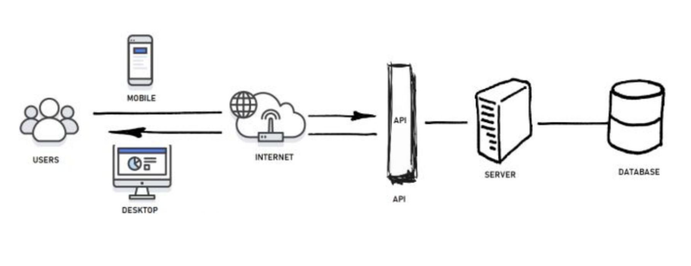
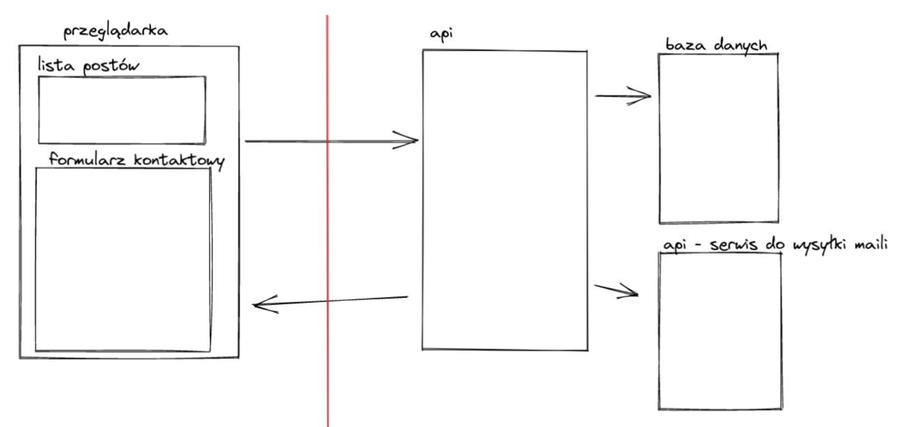
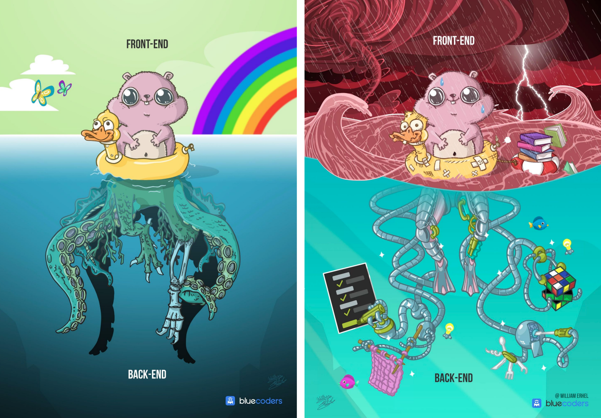
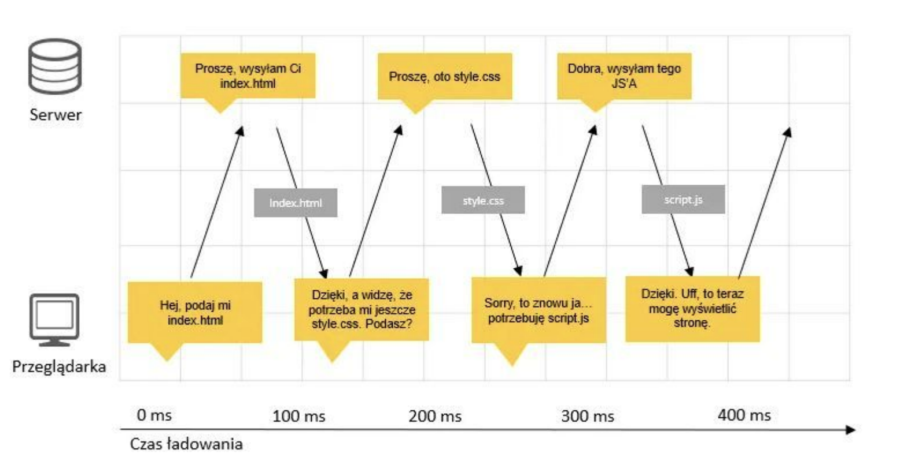
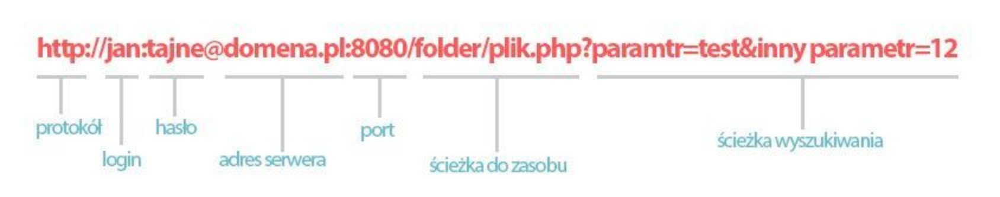
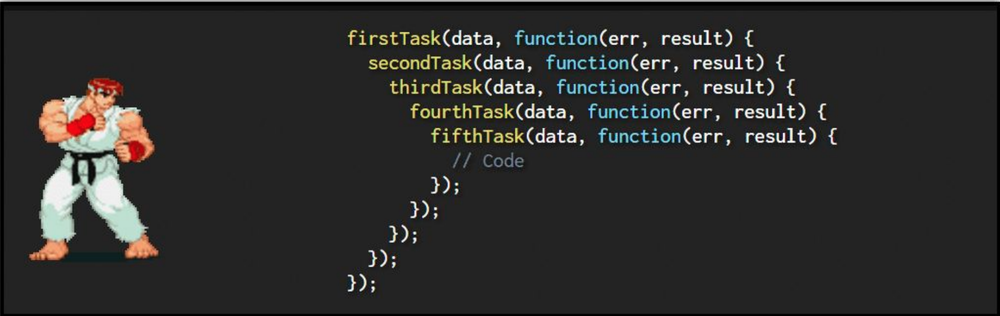

<a href='https://infoshareacademy.com/'></a>

# Fetch API i HTTP

## Plan

- Wprowadzenie do HTTP
- Obsługa requestów HTTP
- Przykłady
- XMLHTTPRequest
- Ćwiczenia

## Przydatne linki

1. [Web.dev Introduction](https://web.dev/introduction-to-fetch/) - Wprowadzenie do fetch
2. [MDN XMLHttpRequest](https://developer.mozilla.org/en-US/docs/Web/API/XMLHttpRequest)- Opis starszego XHTTPRequest
3. [MDN FetchAPI](https://developer.mozilla.org/en-US/docs/Web/API/Fetch_API) - Wprowadzenie do Fetch API

## Prezentacja






API - Application Programming Interface

### HTTP

Hypertext Transfer Protocol

- Protokół - “Zasady wymiany informacji i współpracy programów oraz
  urządzeń komputerowych”
- Protokół HTTP to zasady wymiany informacji pomiędzy dwoma różnymi
  “programami”

Przykładem takiej komunikacji może być klient (przeglądarka) - serwer





#### Z czego składa się zapytanie HTTP?

- metoda ( GET, POST, UPDATE, DELETE, OPTIONS, PUT )
- URL - unique resource location
- Nagłówki - np. authorization, cookie
- Dane dodatkowe - query string, body

#### CRUD

- C - Create -> POST
- R - Read -> GET
- U - Update -> PUT
- D - Delete -> Delete

#### URL



- Example `https://pokeapi.co/api/v2/pokemon?limit=100&offset=100`

#### Nagłówki

Protokół HTTP jest bezstanowy tzn. zapytania nie mają ze sobą nic
wspólnego!

- https://developer.mozilla.org/en-US/docs/Web/HTTP/Headers

#### Dane

- Querystring - dodatkowe parametry w ścieżce zapytania
  - https://domena.com/ścieżka?param1=wart1&param2=wart2
  - https://youtu.be/le7YhnOI68U?t=92
  - https://allegro.pl/listing?string=horizon zero dawn&offerTypeBuyNow=1&stan=nowe&dostawa-kurier=1
- Body - dowolne dane jako string
  - { param: 'value1'}

#### Statusy odpowiedzi

- 1XX - kategoria statusów informacyjnych
- 2XX - kategoria statusów oznaczająca sukces
- 3XX - kategoria statusów przeznaczona dla przekierowań
- 4XX - kategoria statusów przeznaczona dla wskazywania błędów po
  stronie użytkownika
- 5XX - kategoria statusów przeznaczona dla wskazywania błędów po
  stronie serwera

### Kod asynchroniczny

## Przykłady synchroniczne

- Definicja zmiennej
- Wywołanie funkcji
- Operacja na tablicy
- Wyciągnięcie danych z obiektu

## Przykłady asynchroniczne

- setTimeout
- setInterval
- fetch

## Callback

"Jak będziesz miał czas to oddzwoń"

- po upływie sekundy
- wyświetl w konsoli "witaj świecie"

### Callback hell



### Promise

Promise - obietnice, obiekt, dzięki, któremy możemy zareagować
na zakończenie pewnej asynchronicznej operacji.

- Pending - cały czas coś trwa, asynchroniczna operacja jeszcze się nie
  zakończyła
- Fulfilled - operacja zakończona sukcesem
- Rejected - operacja zakończona porażką

### Promise obsługa

- .then(onFulfilled, onRejected) - metoda, która przyjmuje funkcję,
  które będą wykonane w zależności od tego jakim stanem zakończy
  się Promise
- .catch(onRejected) - metoda, która przyjmuje funkcję, która ma zostać
  wykonana w przypadku błędu,
- .finally(onCompleted) - metody do wywołania po zakończeniu
  promisa, niezależnie od jego wyniku

#### Promise chaining

```js
new Promise(function (resolve, reject) {
  setTimeout(() => resolve(1), 1000);
})
  .then((result) => {
    alert(result);
    return result * 2;
  })
  .then((result) => {
    alert(result);
    return result * 2;
  })
  .then((result) => {
    alert(result);
    return result * 2;
  })
  .catch((error) => {
    console.error(error);
  });
```

#### XML HTTP Request

- historycznie :)

```js
const request = new XMLHttpRequest();

request.addEventListener("load", function (event) {
  const pikachu = JSON.parse(event.currentTarget.responseText);
  console.log(pikachu);
});
request.open("GET", "https://jsonplaceholder.typicode.com/users");
request.send();
```

#### Fetch

- aktualnie :)
- Fetch przyjmuje url lub obiekt. Jeśli przyjmie url to domyślnie wyśle
  zapytanie GET. Zwraca promise z odpowiedzią

- prosty przykład

```js
fetch("https://jsonplaceholder.typicode.com/users").then(function (response) {
  console.log(response);
});
```

- Odpowiedź najczęściej będzie zwracana jako obiekt json. By go jednak
  uzyskać musimy najpierw zwrócić metodę response.json().
  Response.json() zwraca promise (promise-chaining).

```js
fetch("https://jsonplaceholder.typicode.com/users")
  .then(function (response) {
    return response.json();
  })
  .then(function (data) {
    console.log(data);
  });
```

- przykład :)

https://dog.ceo/dog-api/documentation/random

### Kilka równocznesnych zadań

#### Równolegle

```js
const asyncWolf = new Promise(function (resolve) {
  setTimeout(function () {
    resolve("🐺");
  }, 1500);
});

const asyncRacoon = new Promise(function (resolve) {
  setTimeout(function () {
    resolve("🦝");
  }, 5000);
});

Promise.all([asyncWolf, asyncRacoon]).then(function (results) {
  console.log(results);
});
```

#### Szeregowo

```js
const asyncWolf = new Promise(function (resolve) {
  setTimeout(function () {
    resolve("🐺");
  }, 1500);
});

const asyncRacoon = new Promise(function (resolve) {
  setTimeout(function () {
    resolve("🦝");
  }, 5000);
});

asyncWolf
  .then(function (wolf) {
    // po 1500
    console.log(wolf);
    return asyncRacoon;
  })
  .then(function (racoon) {
    console.log(racoon);
    // po 1500 plus 5000
  });
```

## Podsumowanie

- Czym jest HTTP i z czego się składa
- Jak korzystać z fetch API
