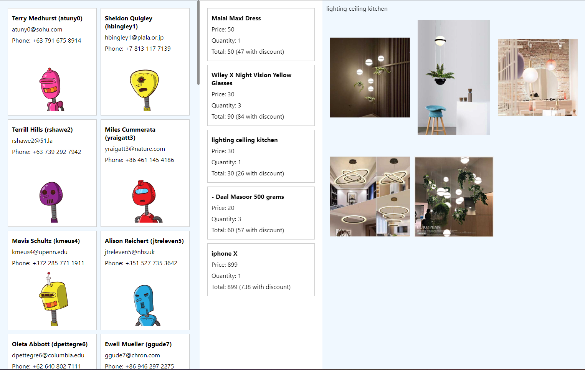
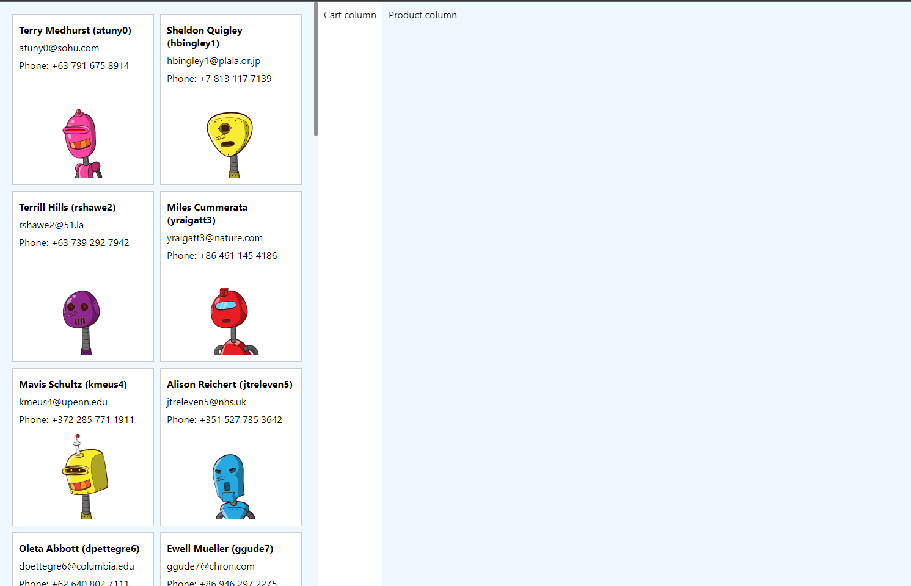
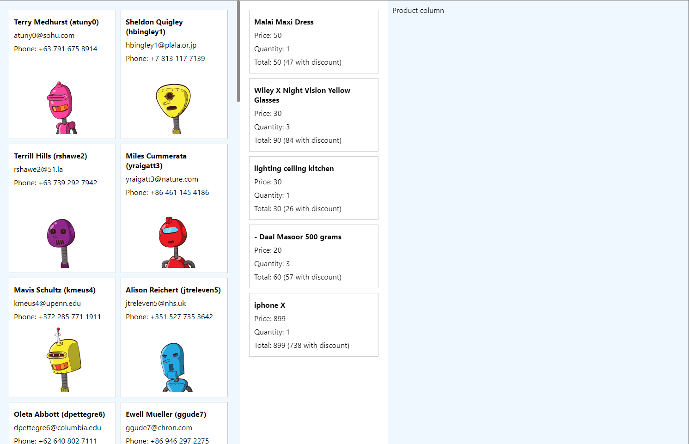
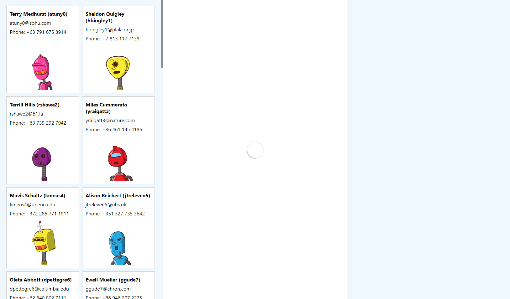
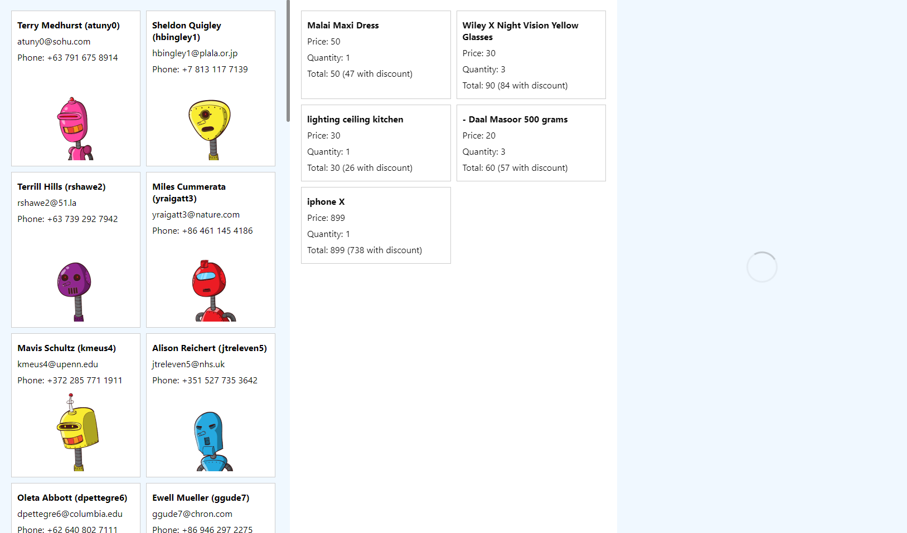

# useEffect i asynchroniczność

React wymaga od nas utworzenia komponentu - funkcji, która jest wywoływana podczas renderowania, i która w dość dużym uproszczeniu
przyjmuje propsy, a my mamy w tej funkcji zwrócić wyrażenie zapisane w notacji `JSX`, które zawiera `Virtual DOM` - czyli taki opis,
co byśmy chcieli zobaczyć w danym momencie na ekranie.
I React postara się spojrzeć na aktualne drzewo DOM w dokumencie, i poprzez _rekoncyliację_ jak najmniejszym kosztem
manipulacji drzewem DOM uzyskać opisaną przez nas strukturę.

Jednak taki komponent o naturze szablonu: "daj mi dane wejściowe a ja podam wynik" - nie jest wystarczający do pisania aplikacji.

Czasem chcielibyśmy wykonać jakieś operacje **asynchronicznie**, czyli poza momentem renderowania (wywołania funkcji) komponentu.

Dowiedzieliśmy się, że kod asynchroniczny można uruchomić poprzez nasłuchiwanie jakiegoś zdarzenia np `onClick` na elemencie.
Co, jeśli chcielibyśmy wykonać kod od razu po pojawieniu się komponentu na ekranie, albo tuż przed jego usunięciem?
Co więcej, czasem chcielibyśmy wykonać kod, jeśli zmieni się jakaś zmienna, np aktualnie zaznaczony elemenent na liście.

Czasem chcielibyśmy nie tylko **deklarować** ale też coś **robić**.
Mowa tutaj o _efektach ubocznych_ (ang. _"Side effect"_).

Efekt w React to nic innego jak przygotowane dla nas miejsce do wykonania asynchronicznego kodu, który będzie
uruchomiony tuż po wyrenderowaniu komponentu (wywołaniu naszej funkcji i analizie zwróconego przez nas Virtual DOMu) i wyrysowaniu zmian na ekranie.
Możemy poprosić Reakta o uruchomienie tego kodu tylko po pierwszym renderze, ale również po każdym renderze,
o ile zmieni się jakakolwiek wartość w podanej tablicy _zależności_.

### Jednorazowo

```js
useEffect(() => {
  // kod wykonywany tylko raz - po zamontowaniu komponentu
}, []); // -- pusta tablica zależności
```

### Przed odmontowaniem

Jeśli useEffect zwróci funkcję - będzie to tzw. **effect cleanup** i zostanie wywołana przed uruchomieniem następnego efektu.

```js
useEffect(() => {
  // ...
  return () => {
    // kod wykonywany tylko raz - przed odmontowaniem komponentu
  };
}, []); // -- pusta tablica zależności
```

### Po zmianie propsa

```js
const Component = ({ foo }) => {
  useEffect(() => {
    // kod wykonywany po każdej zmianie wartości propsa foo
  }, [foo]);
};
```

### Po zmianie stanu

```js
const Component = () => {
  const [foo, setFoo] = useState(1);
  useEffect(() => {
    // kod wykonywany po każdej zmianie wartości stanu foo
  }, [foo]);
};
```

### Po każdym renderze

```js
const Component = () => {
  useEffect(() => {
    // kod wykonywany po każdym renderze
  }); // brak tablicy zależności!!
};
```

### Po zmianie wartości pochodnej

```js
const Component = ({ score }) => {
  const scoreIsNegative = score > 0;
  useEffect(() => {
    // kod wykonywany po każdej zmianie znaku propsa score
  }, [scoreIsNegative]);
};
```

### Wiele zależności

```js
const Component = ({ foo, bar, baz }) => {
  useEffect(() => {
    // kod wykonywany po każdej zmianie wartości propsa foo, bar oraz baz
  }, [foo, bar, baz]);
};
```

### Anulowanie poprzedniego efektu

```js
const Component = ({ userId, albumId }) => {
  useEffect(() => {
    const abortController = new AbortController();
    fetch(`/api/users/${userId}/${albumId}`, {
      signal: abortController.signal,
    }).then(/* ... */);

    return () => {
      abortController.abort(); // spowoduje anulowanie requestu, któego odpowiedzi już nie potrzebujemy
    };
  }, [userId, albumId]);
};
```

## Brak mechanizmu obserwacji

React w stosunku do `useEffect` nie stosuje żadnych mechanizmów obserwowania zmiany wartości samych zmiennych podanych w tablicy zależności.

W szczególności poniższy kod zadziała wbrew pierwotnej intuicji:

```js
const Component = () => {
  let foo = 0;

  useEffect(() => {
    console.log("foo changed", foo);
  }, [foo]);

  return <div onClick={() => (foo += 1)}>{foo}</div>;
};
```

Mimo że powyżej następuje zmiana wartości zmiennej `foo`, to żaden mechanizm nie obserwuje tej zmiany.

To, co powinniśmy zrobić, to użyć mechanizmu `useState`, który po użyciu _settera_ spowoduje
ponowne renderowanie komponentu, a dopiero następnie uruchomienie efektu, o ile od poprzedniego uruchomienia
nastąpiły jakiekolwiek zmiany w wartościach podanych w tablicy zależności.

```js
const Component = () => {
  const [foo, setFoo] = useState(0);

  useEffect(() => {
    console.log("foo changed", foo);
  }, [foo]); // setFoo() spowoduje ponowne wyrenderowanie `Component` i warunkowe uruchomienie efektu

  return <div onClick={() => setFoo((val) => val + 1)}>{foo}</div>;
};
```

Można powiedzieć, że `useEffect` to swego rodzaju filtr, który wykonuje się po każdym renderze, ale nie częściej, i nie zawsze.

## Wykrywanie zmian w zależnościach

Warto też wspomnieć, że porównywanie wartości tablicy zależności odbywa się z użyciem operatora `===` na każdym elemencie.
To znaczy, że jeśli podamy w zależności obiekt o tej samej strukturze, ale różny referencyjnie, to efekt będzie się wykonywał po każdym renderze.

```js
const Component = ({ foo, bar }) => {
  const [bar, setBar] = useState(0);
  const fooAndBar = { foo, bar };

  useEffect(() => {
    console.log("fooAndBar changed", fooAndBar);
  }, [fooAndBar]);

  return <div>...</div>;
};
```

Powyższy kod uruchomi efekt po każdym renderze komponentu nawet, jeśli foo i bar będą niezmienione,
gdyż w każdym renderze stała `fooAndBar` przyjmuje nowotworzony obiekt.
A jak pamiętamy, takie obiekty nie są sobie równe, nawet jeśli mają taką samą zawartość, ponieważ odwołują się do różnych miejsc
w pamięci RAM komputera.

## Złota zasada

Efekt powinien mieć podane w zależnościach wszystkie wyrażenia, do których się odnosi w implenentacji.
Jeśli tego nie zrobimy, najprawdopodobniej będziemy mieli błąd, że nasz efekt nie będzie odzwierciedlał rzeczywistości:

```js
const MoviePage = ({ movieId }) => {
  const [movie, setMovie] = useState(null);
  useEffect(() => {
    getMovieById(movieId).then(setMovie);
  }, []);
};
```

Poniższy kod nie ma podanego `movieId` w zależności, ale do tej pory działa w aplikacji.
Dlaczego więc jest niepoprawny?
Jeśli przyjrzymy się samemu komponentowi, to będzie on tak długo działał, dopóki nie zostanie
wyrenderowany z nowym movieId. W przypadku zmiany propsa movieId efekt nie będzie uruchomiony, a dane będą adekwatne do propsa.

Dlatego też mamy regułę w ESLint: `react-hooks/exhaustive-deps`.
Będzie ona pilnowałą, aby nie zapomnieć o niczym w naszej tablicy zależności.

## Zadania

Zadanie polega na zbudowaniu prostej przeglądarki koszyków użytkowników w sklepie internetowym.



**Uwaga**: Aby nie robić wszystkiego od zera, wykorzystać komponenty:

- `<GridContainer/>` - wyświetla dzieci w ładnej siatce
- `<UserItem/>` - wyświetla kafelek użytkownika (propsy zgodne z API)
- `<ProductItem/>` - wyświetla kafelek produktu (propsy zgodne z API)
- `<ProductPreview/>` - wyświetla podgląd produktu z galerią (propsy zgodne z API)
- `<Spinner/>` - prosty komponent do wyświetlania stanu ładowania

#### Zewnętrzne API

Możemy posłużyć się testowym API zewnętrznym

| zasób                       | adres                              |
| --------------------------- | ---------------------------------- |
| lista użytkowników          | https://dummyjson.com/users        |
| lista koszyków usera o id=5 | https://dummyjson.com/carts/user/5 |
| lista produktów             | https://dummyjson.com/products     |
| dane produktu o id=1        | https://dummyjson.com/products/1   |

### Task 1

#### Proste ładowanie i wyświetlanie listy

1. użyj funkcji getAllUsers aby pobrać listę użytkowników i wyświetlić ją w konsoli
2. zmień kod tak, aby zamiast wyświetlać w konsoli - wyświetlić elementy `<UserItem/>` wewnątrz `<GridContainer>`

Efekt końcowy: lista użytkowników z nazwami oraz avatarami (i innymi szczegółami z API) w lewej kolumnie

Oczekiwana przykładowa struktura:

```jsx
<AppLayout
  usersColumn={
    <GridContainer>
      <UserItem firstName="Terry" lastName="Medhurst" /* kolejne propsy */ />
      <UserItem firstName="Sheldon " lastName="Quigley " /* kolejne propsy */ />
      {/* ... kolejne UserItem */}
    </GridContainer>
  }
/>
```



**Uwaga**: powyższe nie reprezentuje kodu wynikowego, zwróć uwagę, że lista `<UserItem>` będzie generowana dynamicznie z API (metoda `map()` na tablicy).

**Uwaga**: sprawdzić, czy lista użytkowników nie jest ładowana w nieskończoność

**Uwaga**: na tym etapie można przechowywać tylko stan listy - pusta inicjalna oraz z API

### Task 2

#### Parametryzowane ładowanie i wyświetlanie listy

1. dodaj możliwość kliknięcia na użytkowniku, co spowoduje wyświetlenie nazwy użytkownika w środkowej kolumnie (pomocna może być metoda `find()` na tablicy)
2. każdorazowe kliknięcie innego użytkownika powinno ładować koszyk i wyświetlać jego produkty w środkowej liście - wyświetlić elementy `<ProductItem>` wewnątrz `<GridContainer/>`

Efekt końcowy: w środkowej kolumnie wyświetlają się produkty koszyka klikniętego użytkownika

Oczekiwana przykładowa struktura:

```jsx

<AppLayout
    usersColumn={
        /* jak do tej pory */
    }
    cartColumn={
        <GridContainer>
            <ProductItem title="Malai Maxi Dress" price="50" /* ... */ />
            <ProductItem title="Wiley X Night Vision Yellow Glasses" price="30" /* ... */ />
        </GridContainer>
    }
/>
```



**Uwaga**: użytkownik może nie mieć żadnego koszyka

**Uwaga**: API zakłada, że użytkownik może mieć wiele koszyków, ale możemy zignorować pozostałe koszyki i uznać, że albo nie ma wcale (pusta tablica) albo ma jeden koszyk (tablica z jednym elementem).

### Task 3

#### Synchronizacja danych zależnych

1. dodaj możliwość kliknięcia w produkt w koszyku
2. każdorazowe kliknięcie innego produktu powinno pokazać podgląd produktu w kolumnie prawej - element `<ProductPreview/>`
3. jeśli nastąpi zaznaczenie innego użytkownika, zadbaj, aby nie były wyświetlane dane produktu w prawej kolumnie, ponieważ dotyczą one produktu z koszyka innego użytkownika

Efekt końcowy: w prawej kolumnie wyświetla się info o wybranym produkcie wraz z galerią obrazków.

Oczekiwana przykładowa struktura:

```js
<AppLayout
    usersColumn={
        /* jak do tej pory */
    }
    cartColumn={
        /* jak do tej pory */
    }
    productColumn={
        <ProductPreview title="Malai Maxi Dress" /* ... */ />
    }
/>
```


### Task 4

#### Stan ładowania

1. do listy użytkowników dodaj spinner widoczny podczas ładowania
2. analogicznie - do listy produktów w koszyku
3. analogicznie - do podglądu zaznaczonego produktu
4. zadbaj o to, aby spinner nie wyświetlał się w prawej kolumnie, jeśli jeszcze nie został wybrany produkt





### Bonus task

1. podświetlaj zaznaczonego użytkownika na wybrany kolor
2. analogicznie podświetlaj zaznaczony produkt na liście
3. zaznaczaj automatycznie pierwszy produkt na liście
4. zaznaczaj automatycznie pierwszego użytkownika z listy
5. a może pomyśl o błędach ładowania z API
