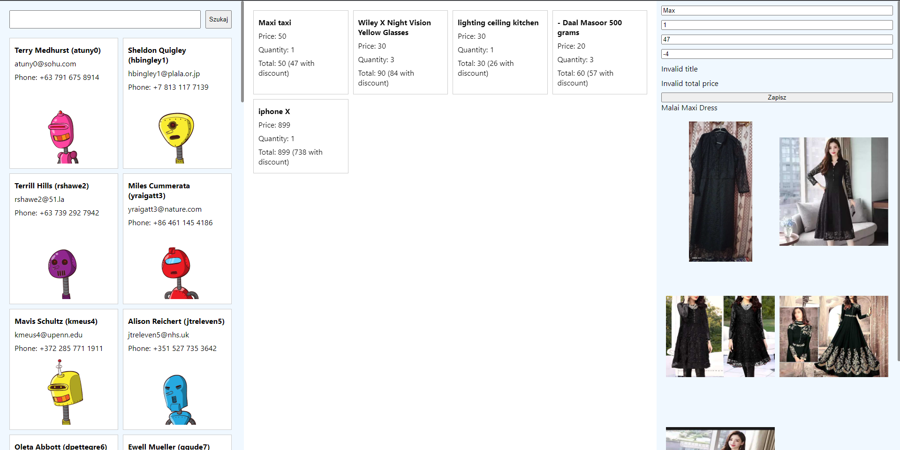

# Praca z formularzami

Komponent w React pozwala nam na opisanie oczekiwanej struktury HTML dzięki `Virtual DOM` oraz
notacji `JSX`.

Co więcej, możemy dzięki konstrukcji `useState()` definiować i modyfikować unikalny stan dla komponentu, a jego zmiana
spowoduje przerenderowanie komponentu, co skutkuje kolejnym, odrębnym wywołaniem całej funkcji i wygenerowaniem nowego opisu struktury naszego kawałka UI.

Następnie poznaliśmy jak reagować na zdarzenia użytkownika, np dzięki propsowi `onClick` przypisanemu do elementu `<button>`.

Dowiedzieliśmy się również, jak dzięki `useEffect` wykonywać kod w reakcji na zamontowanie, odmontowanie lub
przerenderowanie komponentu z jednoczesną jakiekolwiek zmianą w tablicy zależności.

Nadszedł czas na poznanie kolejnego mechanizmu, bez którego napisanie sensownej aplikacji w Reakcie byłoby niemożliwe.

Mowa o współpracy z formularzami, a nawet pojedynczymi polami formularza.
Samo budowanie formularza nie różni się niczym od tego, jak to robiło się w czystym HTML i JS, natomiast
będziemy tutaj szczególnie przyglądać się sposobowi ustalania i odczytu wartości w formularzu.

## Pole formularza

> **Uwaga**: do samodzielnej pracy zaleca się skorzystanie z projektu `worksheet`.

Spróbujmy wyświetlić prosty `input`:

```js
const Component = () => {
  const handleSubmit = (event) => {
    event.preventDefault();
    console.log("Szukaj...!");
  };
  return (
    <form onSubmit={handleSubmit}>
      <label>
        Podaj wartość: <input id="search" />
      </label>
      <button type="submit">Szukaj</button>
      <button type="button">Resetuj</button>
    </form>
  );
};
```

Takie proste użycie elementu `input` pozwala na swobodne pisanie wewnątrz tego pola, lecz jeśli chcielibyśmy
dowiedzieć się, jaka wartość jest w polu _search_, to musielibyśmy odwołać się do natywnego elementu DOM w celu odczytania wartości.

**Uwaga**: zwróćmy uwagę na `event.preventDefault()` w `handleSubmit`.
Tak jak w czystym JS, w React też musimy zapobiec domyślnemu działaniu wysłania formularza, np jeśli naciśniemy enter wewnątrz jakiegoś pola.

```js
const Component = () => {
  const handleSubmit = (event) => {
    event.preventDefault();
    console.log("Szukaj:", document.getElementById("search").value);
  };
  return (
    <form onSubmit={handleSubmit}>
      <label>
        Podaj wartość: <input id="search" />
      </label>
      <button type="submit">Szukaj</button>
      <button type="button">Resetuj</button>
    </form>
  );
};
```

To podejście ma dwie wady:

1. polega na globalnym ID, czyniąc komponent niereużywalnym
2. jest niereaktowe: w Reakcie powinniśmy unikać bezpośredniego dostępu do DOM API.

Możemy zaadresować punkt pierwszy, to znaczy nie polegać na globalnym ID.

### useRef

Jak pamiętamy, w momencie renderowania nic jeszcze nie zostało wyświetlone na ekranie,
jesteśmy dopiero na etapie mówienia Reaktowi, co byśmy chcieli, aby było na ekranie.
W szczególności nie powinniśmy odwoływać się do tego, co już wcześniej zostało wyświetlone, gdyż prawdopodobnie
nie ma to wiele wspólnego z tym, co zostanie utworzone na podstawie tego, co dopiero zadeklarujemy,
zwracając drzewo wirtualne podczas renderowania.

useRef to narzędzie Reactowe, które pozwala nam na dostęp do natywnych elementów HTML, które zostały finalnie utworzone przez Reacta na rzecz tych elementów
wirtualnych, opisanych w naszej notacji `JSX`.
Jest to alternatywa do stosowania globalnych ID, ale tutaj nie trzeba tworzyć żadnych identyfikatorów.
Wystarczy utworzyć obiekt referencji (`useRef()`) a następnie przekazać ten obiekt do specjalnego propsa `ref` dowolnego
elementu HTML w zwracanym drzewie wirtualnym.

Następnie w kodzie asynchronicznym, już po wyrenderowaniu przez Reakta naszego komponentu, możemy dostać się do aktualnie skojarzonego
elementu natywnego HTML poprzez pole `.current`.

```js
const Component = () => {
  const buttonRef = useRef();

  const handleSubmit = (event) => {
    event.preventDefault();
    console.log("Szukaj:", buttonRef.current.value);
  };
  return (
    <form onSubmit={handleSubmit}>
      <label>
        Podaj wartość: <input id="search" ref={buttonRef} />
      </label>
      <button type="submit">Szukaj</button>
      <button type="button">Resetuj</button>
    </form>
  );
};
```

**Uwaga**: `useRef` ma jeszcze inne zastosowania, niemniej jednak na potrzeby kursu skupimy się tylko na używaniu jego w celu uzyskania
dostępu do DOM.

### Tryb niekontrolowany

Powyższy komponent `input` został użyty w trybie niekontrolowanym.

Oznacza to, że stan aktualnej wartości w polu jest dla nas niedostępny, nie mamy nad nim kontroli z punktu widzenia naszego komponentu Reactowego.

Oczywiście, można zawsze odwołać się do natywnego elementu DOM, ale z punktu widzenia Reacta nie jest to wskazane.

Wiele komponentów formularza wspiera tzw. propsy domyślne, najczęściej o nazwie `defaultValue`.

Jeśli zastosujemy tego propsa do naszego pola, jesteśmy w stanie ustalić wartość początkową naszego inputa:

```js
const Component = () => {
  const buttonRef = useRef();

  const handleSubmit = (event) => {
    event.preventDefault();
    console.log("Szukaj:", buttonRef.current.value);
  };
  return (
    <form onSubmit={handleSubmit}>
      <label>
        Podaj wartość:
        <input id="search" ref={buttonRef} defaultValue="foobar" />
      </label>
      <button type="submit">Szukaj</button>
      <button type="button">Resetuj</button>
    </form>
  );
};
```

**Uwaga**: późniejsza zmiana propsa `defaultValue` nie zaktualizuje wartości pola, gdyż ten props jest brany pod uwagę
tylko przy inicjalizacji wewnętrznego stanu pola w trybie niekontrolowanym.

### Tryb kontrolowany

Często się zdarza, że z punktu widzenia komponentu, który tworzymy, chcielibyśmy mieć większą władzę nad wartością pola
formularza, niż podanie inicjalnej wartości oraz pozwolenie na dowolne wpisywanie wartości przez użytkownika.

W tym celu musimy "przejąć" władzę nad stanem komponentu, tworząc go w trybie kontrolowanym.

Tryb kontrolowany wymuszany jest zazwyczaj poprzez podanie wartości do propsa właściwego, np: `value` zamiast `defaultValue`,
`checked` zamiast `defaultChecked`, czy `opened` zamiast `defaultOpened`.
Jest to swego rodzaju konwencja, ale wszystkie natywne (oraz wiele popularnych bibliotek) są w ten sposób ustawione.

```js
const Component = () => {
  const handleSubmit = (event) => {
    event.preventDefault();
    console.log("Szukaj: ???");
  };
  return (
    <form onSubmit={handleSubmit}>
      <label>
        Podaj wartość:
        <input value="foobar" />
      </label>
      <button type="submit">Szukaj</button>
      <button type="button">Resetuj</button>
    </form>
  );
};
```

Wydaje się, że ustalenie propsa `value="foobar"` rozwiązało sprawę, niemniej jednak podając na sztywno propsa `value`
zablokowaliśmy jakąkolwiek możliwość interakcji użytkownika z tym polem, które teraz wydaje sie "głuche" na wciskanie klawiszy.
Jest to spowodowane tym, że przejęliśmy kontrolę nad komponentem, i mówimy wprost, że pole ma mieć zawsze wartość "foobar".

Jest to mało użyteczne, dlatego też powinniśmy niejako zamknąć przerwaną pętlę interakcji korzystając z mechanizmu `useState`
oraz nasłuchiwania zdarzenia `onChange`.

```js
const Component = () => {
  const [search, setSearch] = useState("foobar");

  const handleSubmit = (event) => {
    event.preventDefault();
    console.log("Szukaj:", search);
  };
  return (
    <form onSubmit={handleSubmit}>
      <label>
        Podaj wartość:
        <input
          value={search}
          onChange={(event) => setSearch(event.currentTarget.value)}
        />
      </label>
      <button type="submit">Szukaj</button>
      <button type="button">Resetuj</button>
    </form>
  );
};
```

Kontrolując stan pola z poziomu naszego komponentu, możemy dowolnie go zmieniać, np resetować do domyślnej wartości po
naciśnięciu przycisku:

```js
<button type="button" onClick={() => setSearch("foobar")}>
  Resetuj
</button>
```

## Zadanie 1

Skorzystać z projektu task-1

1. powyżej listy użytkowników dodać formularz z polem tekstowym i przyciskiem "szukaj" - komponent `SearchForm`
2. wysłanie formularza powinno przeładować listę użytkowników
3. do wyszukiwania użytkowników należy użyć `findUsers(fraza)`

**Uwaga**: pamiętać, aby przy wyszukiwaniu odznaczyć aktualnie zaznaczonego użytkownika, aby nie wyświetlać nieadekwatnych danych

Oczekiwana przykładowa struktura:

```js
<AppLayout
  usersColumn={
    <>
      <SearchForm /* propsy do SearchForm */ />
      {/* pozostały kod wyświetlający listę użytkowników */}
    </>
  }
  cartColumn="..."
  productColumn="..."
/>
```


## react-hooks-form

Istnieje wiele bibliotek, które maksymalnie optymalizują i ułatwiają pracę nad skomplikowanymi formularzami.
Jedną z nich jest `react-hook-form`.

Największą bolączką jest, gdy chcemy kontrolować stan wielu pól formularzy, wpływa to na wydajność i niepotrzebne rerendery
komponentu formularza.
Dzięki mechanizmowi subskrypcji możemy podpiąć każde pole osobno do stanu formularza, nie powodując przerenderowania
pozostałych pól.

> Dokumentacja: https://react-hook-form.com/get-started

Przeanalizujmy najprostszy przykład z tej dokumentacji:

```js
import { useForm } from "react-hook-form";

const App = () => {
  const {
    register,
    handleSubmit,
    watch,
    formState: { errors },
  } = useForm();

  const onSubmit = (data) => console.log(data);

  console.log(watch("example")); // watch input value by passing the name of it

  return (
    /* "handleSubmit" will validate your inputs before invoking "onSubmit" */
    <form onSubmit={handleSubmit(onSubmit)}>
      {/* register your input into the hook by invoking the "register" function */}
      <input defaultValue="test" {...register("example")} />

      {/* include validation with required or other standard HTML validation rules */}
      <input {...register("exampleRequired", { required: true })} />
      {/* errors will return when field validation fails  */}
      {errors.exampleRequired && <span>This field is required</span>}

      <button type="submit">Zapisz</button>
    </form>
  );
};
```

`useForm` uruchamia specjalną instancję z biblioteki `react-hook-form` która będzie współpracowała
z naszym komponentem.
Wywołanie tego _hooka_ zwraca:

- `handleSubmit` - funkcja wyższego rzędu, którą podana do `onSubmit` formularza najpierw sprawda, czy
  formularz nie zawiera błędów, a dopiero woła oryginalną funkcję
- `formState` (w tym pole errors) - dostęp do ważnych części stanu formularzy (uwaga: formState jest obiektem typu proxy, [więcej info](https://react-hook-form.com/api/useform/formstate/))
- `watch(fieldName)` - zwraca aktualną wartość pola `fieldName` w formularzu, ale jednocześnie
  zapewnia, że jeśli wartość tego pola się zmieni, to cały komponent zostanie przerenderowany
- `register(fieldName)` - służy do integracji pojedynczego pola formularza, zwraca propsy które należy dodać do elementu html formularza

## Zadanie

Do naszej aplikacji dodajmy możliwość edycji zamówienia danej osoby.

1. W propsie `productColumn` dodaj ponad `<ProductPreview>` element `<CartItemEdit>`,
2. Skonfiguruj formularz z `react-hook-form` dla tych pól
   1. title: tekst - obowiązkowe, minimalna długość: 5 znaków, maksymalna: 40
   2. quantity: liczba - obowiązkowe, wartość min. 0
   3. discountedPrice: liczba - obowiązkowe, wartość min. 0
   4. total: liczba - obowiązkowe, wartość min. 0
3. Przycisk Zapisz powinien wyświetlić na konsoli aktualną wersję produktu z koszyka
4. bonus: odczytując pole `errors` wyświetlić warunkowo błędy pod polami formularza
5. bonus: wysłanie formularza powinno faktycznie zmienić produkt z koszyka
   Uwaga: nie będziemy zapisywać niczego na serwerze, więc kliknięcie na innego użytkownika
   i z powrotem na poprzedniego spowoduje załadowanie produktów z koszyka na nowo.

**Uwaga**: przy wysłaniu formularza nasze pola liczbowe będą typu `string`.
Aby temu zaradzić, należy użyć opcji `valueAsNumber` przy rejestracji pola.


