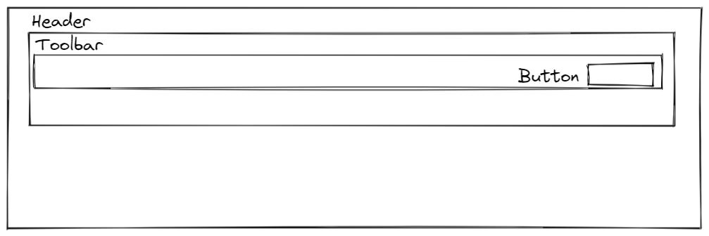

# ⛏️ Część praktyczna

## Zadanie 1 - problem z _props-drilling_

Przygotuj strukturę komponentów odpowiadającą poniższemu schematowi:



**Dla ułatwienia zdefiniuj wszystkie komponenty w jednym pliku `App.js`.**

Główny komponent `<App />` niech ma lokalny stan (nazwa i wartość stanu dowolna). Stan ten powinien zostać wyrenderowany w treści przycisku w komponencie `<Button />`.

Po wykonaniu zadania zastanów się nad "wygodą" i utrzymywalnością kodu, gdzie drzewo komponentów byłoby większe.

## Zadanie 2 - rozwiązanie problemu z użyciem kontekstu

Wykorzystaj komponenty jak w zadaniu poprzednim, tym razem przekazując wartość stanu za pomocą kontekstu. Nazwę kontekstu pozostawiam Tobie.

## Zadanie 3 - modularyzacja

Wykorzystaj kod z poprzedniego zadania, ale podziel komponenty na osobne pliki.

## Zadanie 4 - tryb ciemny i jasny

Tym razem w stanie będziemy przechowywać nieco sensowniejsze informacje. W ramach tego zadania trzymaj obiekt który będzie definiował kolory dla trybu ciemnego i trybu jasnego aplikacji. W komponencie `<Button>` na czas tego zadania wyrenderuj dwa przyciski - jeden powinien wykorzystywać kolorystykę dla trybu jasnego, drugi kolorystykę dla trybu ciemnego.

## Zadanie 5 - wydzielenie _Providera_

W praktyce kontekstu nie trzymamy w danym komponencie w drzewie, tylko robimy dla niego dedykowany komponent, który opakowuje _Providerem_ przekazane do niego dzieci:

```react
<SampleContext.Provider>
    {children}
</SampleContext.Provider>
```

Na bazie kodu z poprzedniego zadania, utwórz osobny plik gdzie wydzielisz komponent `Provider` , a następnie użyj go w swojej aplikacji przekazując do niego (jako `children`) komponent `Header`.

## Zadanie 6 - aktualizacja danych w _Context_ z poziomu _Providera_

Aktualnie bazowaliśmy tylko na statycznych danych w naszym _Context_, a dane oczywiście mogą zostać zaktualizowane. W momencie kiedy zaktualizujemy te dane _Consumer_ będzie miał dostęp do aktualnych danych w _Context_.

Twoim zadaniem będzie modyfikacja pliku w którym trzymasz _Provider_ i dodanie przycisku który pozwoli na zmianę aktualnego trybu kolorystycznego (ciemny, jasny). W komponencie `<Button />` upewnij się, że renderujesz jeden, niezależny przycisk którego styl kolorystyczny jest zmieniany poprzez przycisk z _Providera_.

## Zadanie 7 - aktualizacja danych w _Context_ z poziomu _Consumer'a_

Zmodyfikuj powyższe zadanie tak, abyś mógł zmieniać tryb kolorystyczny z dowolnego elementu w drzewie komponentów np. z poziomu przycisku w komponencie `<Button />`
